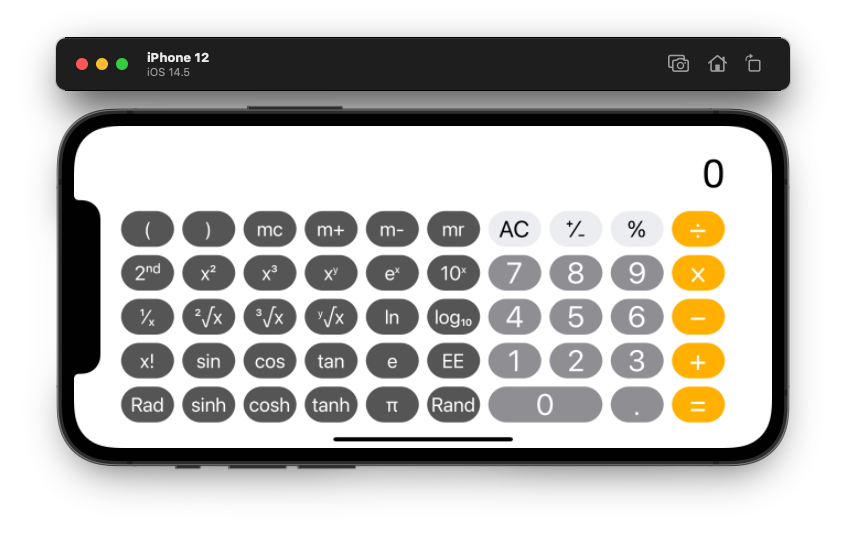
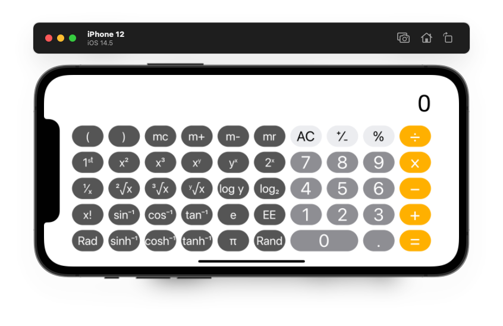
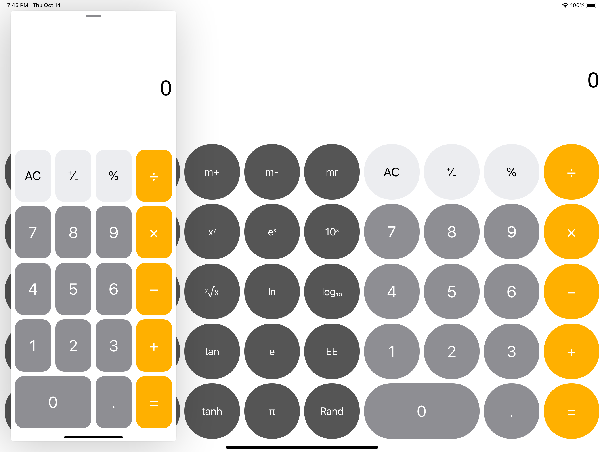
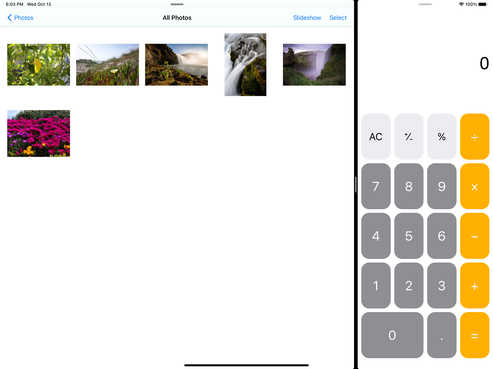

# iOS智能应用开发 项目文档

### 作业1 计算器

191220171 张宇晨

#### 功能介绍

**本计算器支持所有按钮功能，包括一个存储器并支持相关操作**（`mc`, `m+`, `m-`, `mr`）**：**

但其运算优先度将有所不同：

+ 双目运算符的优先级低于单目运算符

	*即输入数字后按下单目运算符将会优先运算得出该运算的结果，该结果可作为此前输入的双目运算符的第二个操作数*

+ 双目运算符间无优先级差异；单目运算符间无优先级差异
+ 输入型运算符（即按下后得到常量、随机值或已储存数值的运算符）等效于进行不可添加的覆盖输入
+ 由于默认仅支持单步运算，输入括号并无实际意义，但会按一般计算器的其他逻辑进行处理，例如按下右括号后会立刻得出当前结果

**在满足系统版本最低要求下，本应用支持所有iPhone和iPad，并可在iPad上的分屏窗口或弹出窗口正常使用；且可以同时开启多个该应用程序而不至冲突。** *运行视频和截图部分将展示相应图片。*

**特别实现的功能**

+ **能够执行如下的捷径操作：**

	+ 连续按下`=`键，如果此前没有清零（`C`），将重复执行上一次的运算操作

		*例如按下*`1 + 2 =`*后得到*`3`*，继续按下*`=`*将重复执行*`+2`*操作得到*`5`*，以此类推*

	+ 清零（`C`）后输入数字，然后继续按下`=`键，将以0为第一个操作数、输入数字为第二个操作数，执行清零前的运算操作，本次操作满足上一捷径，继续按下`=`后能重复执行

		*例如执行了*`1 + 2 =`*操作后按下*`C`*清零，计算器仍记忆上一次运算操作为*`+`*，输入*`3 =`*后显示*`3`*，上一次操作即变更为*`+3`*，继续按下*`=`*将得到*`6`

	+ 完全清零（`AC`）可清除上一次操作的记忆，上一条捷径操作将变为不可用

	+ 输入数字后按下清零（`C`）仅会清除当前输入的数字，如果此前输入过运算符，运算符仍会保留以供重新输入数字继续运算

	+ 输入运算符后按下清零（`C`）仅会清除该运算符，如果此前输入过数字或有前一次计算结果，对应值将会保留以供重新输入运算符继续运算

+ 避开了iOS原生计算器的一个bug：

	*输入*`2 + (`*后按下清零*（`C`）*，计算器无法正确清除符号，此后进行任何双目操作都只能返回输入的值而无法正确计算，只有按下完全清零*（`AC`）*才能正确复位。*

	`Z Calculator`*会正确地将括号和运算符号一并清除，因而不会发生这一问题。*

#### 运行视频和截图

运行视频请见于[iOS智能应用开发 第1次作业 运行录屏](https://www.bilibili.com/video/BV1YR4y1H7mL/)

下面分别展示iPad侧拉窗口、分屏浏览和iPhone竖屏状态下的运行截图：

iPad Slide-over Window

iPad Split View

iPhone Portrait View

#### 值得一提的代码实现

为了实现更高的精度，如果可能，在运算中均使用`Decimal`作为值类型，在不支持`Decimal`的情况下（例如`sin`等函数的调用）才会转换为`Double`运算，运算结果均以`Decimal`保存。`NSDecimalNumber`虽然支持更多运算，但大多`Decimal`不支持的函数仍无法替代，综合调用开销和实用程度选择了`Decimal`。

`Calculator`类中加入了`memoryValue`、左括号输入数量`haveLeftParenthese`、上一次的算式`lastOp`、是否使用弧度表示`isUsingRad`和上一个输入是否是插入值`lastOpIsInsertedValue`。这些内容可以分别实现对存储器的相关支持、正确判断输入右括号时应进行的操作、连续输入`=`的捷径、弧度表示支持和诸如`π`、`Rand`等插入值的正确识别。

`Calculator`类加入了一个函数`isArithmeticSymbol`，便于`ViewController`调用来确定输入的符号是否是算术符号，以辅助实现一个特性。

`ViewController`中在视图加载完成通知函数`viewDidLoad`中加入通知监听，在设备朝向改变时调用`receivedRotation`以正确更改界面；`viewDidLoad`中首先获取当前视图的宽和高，并根据朝向修正这两个值：*视图的宽和高有时恰好相反，如横屏时返回的高值反而更大，此时需需要手动进行修正*。计算出合适的按钮大小、按钮区视图大小和显示区视图大小后，逐层逐个修改对应内容的大小并正确设置按钮圆角半径。

由于前述以`Decimal`作为值类型，其与用于显示的`displayLabel`字符串需要互相转换，其中从计算结果转换至字符串时，由于字符串最好不要显示过多的位数等原因，增加了一系列代码用于判断具体情形并决定是否要修改显示方式，如舍约至0、末尾四舍五入等，同时为避免四舍五入造成精度误差过大，使用参数`lastResult`和`isLastResultValid`来实现上次结果的精确存储并判断是否应作为参数在计算时替代`displayLabel`进行传入。*这里用到了前述*`isArithmeticSymbol`*函数辅助判断值是否有效*。

按钮显示标题的切换添加了对应动作调用，相较前述内容比较简单，不在此赘述。
